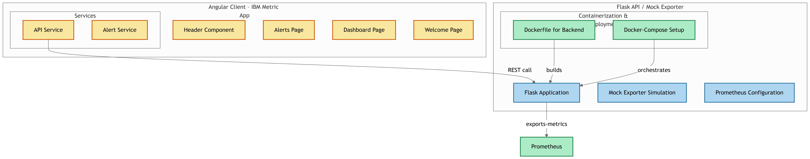
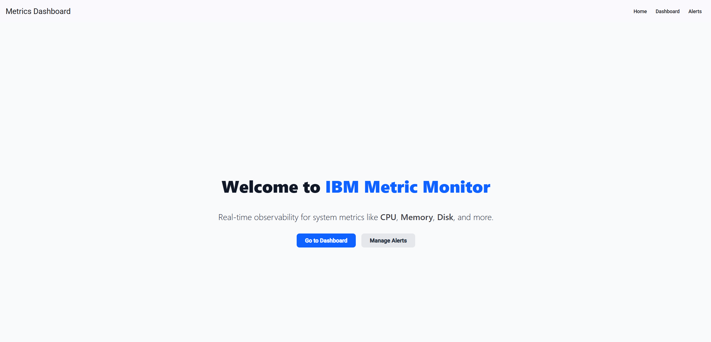
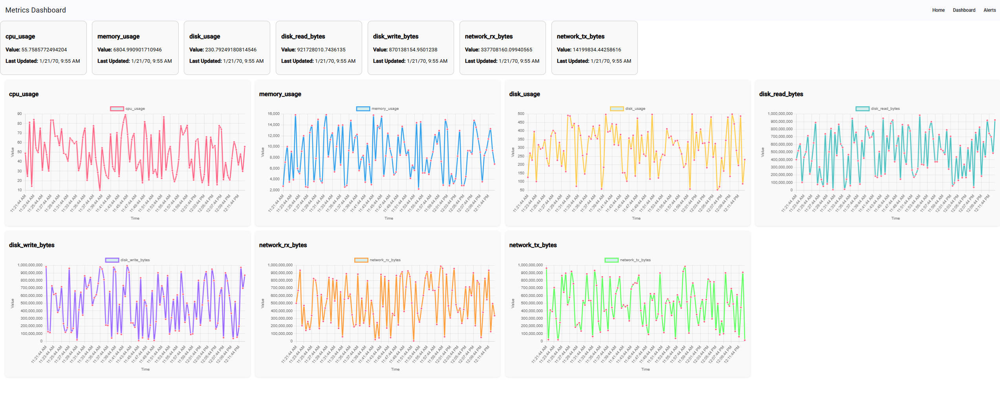
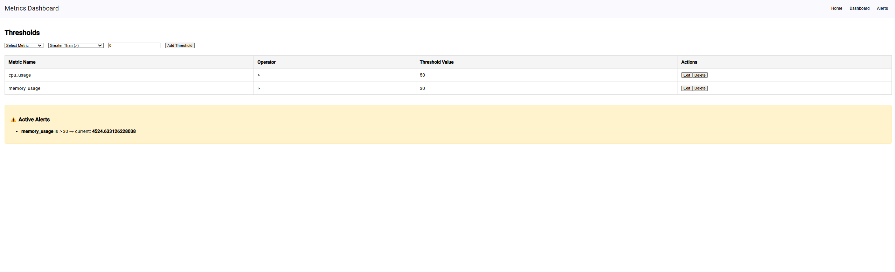

# IBM Metric Monitoring App

This project provides a simple metric monitoring dashboard built with Angular, alongside a mock data exporter containerized with Docker. It is designed to help visualize and test metric collection for monitoring tools like Prometheus.

---

### Required:
- [Docker](https://www.docker.com/)  
- [Node.js](https://nodejs.org/)  
  - Versions supported:  
    `^18.19.1 || ^20.11.1 || >=22.0.0`
- [npm](https://www.npmjs.com/)  
  - Versions supported:  
    `^6.11.0 || ^7.5.6 || >=8.0.0`

##  Project Structure

```
.
├── IBM-assignment/
│   └── client/
│       └── ibm-metric-app/       # Angular frontend application
├── mock-exporter-clone/          # Dockerized Prometheus mock exporter
├── make.sh                       # Shell script to set up and run the project
└── README.md                     # You're here!
```

---                    # You're here!

## Flow 




### Step 1: Clone the repository (if not already)

```bash
git clone https://github.com/abhidesai6/metrics-app.git
cd /metrics-app
```

### Step 2: Make the script executable (only once)

```bash
chmod +x make.sh
```

### Step 3: Run the project

```bash
./make.sh
```


## Project snapshots

#### Welcome page 


#### Dashboard 


#### Manage Alerts page 
